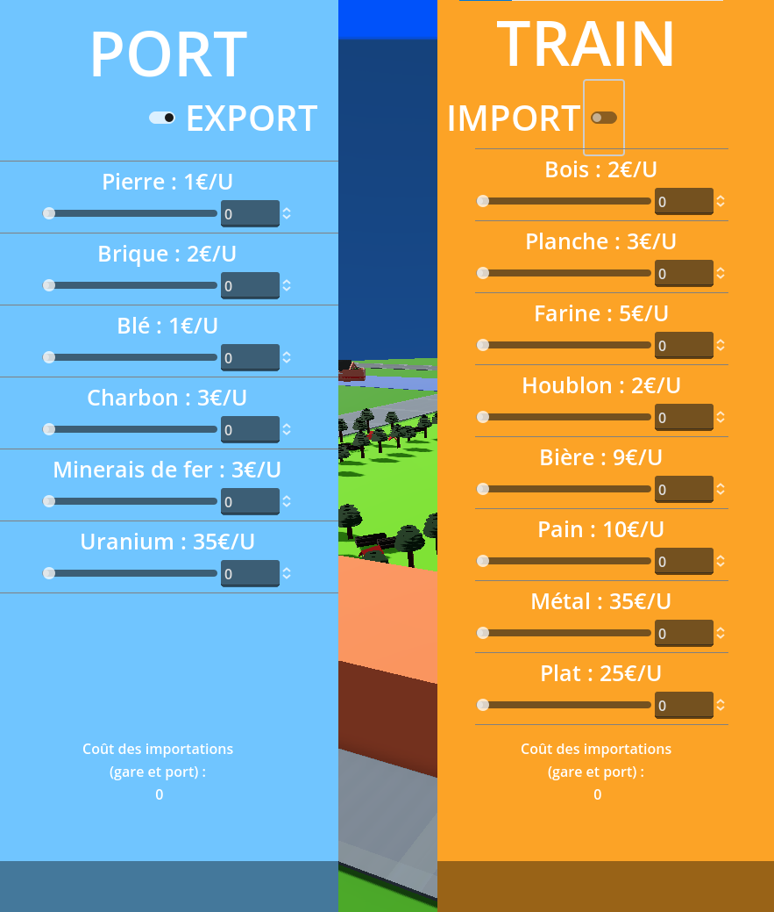
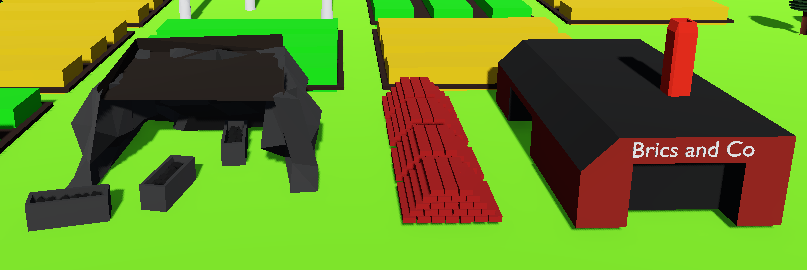
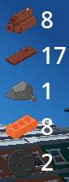
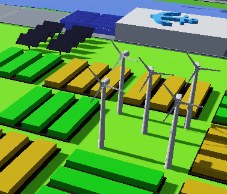
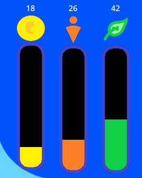
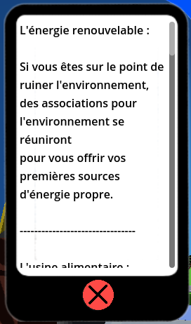

# Description

## Sous-ensemble des objectifs pédagogiques

### Comprendre la territorialisation et la déterritorialisation

**Territorialisation :** 

La reterritorialisation correspond au processus par lequel les personnes renforcent leur lien et contrôle sur le territoire. Celui-ci subit des changements à cause des nombreuses activités, fragmentées sur toute sa surface. Les changements sont de type social, économique et écologique.
En outre, elle permet aux individus de profiter du territoire et adapter de nombreuses activités économiques selon les possibilités disponibles ; par la suite, le développement de ces activités entraîne des enjeux socio-économiques qui vont impacter l'environnement. Ces activités s'étalent à partir de sa création en fonction de sa rentabilité et les ressources disponibles.
La reterritorialisation sera représentée par l’étude du quartier Est du Koenigshoffen, qui se voit pourvu d’une nouvelle ligne ferroviaire (et une gare) passant par un territoire vide et exploitable.

**Déterritorialisation :**
Utilisation du territoire en prenant en compte la capacité de déplacement accrue des ressources, et en faisant moins attention à la proximité directe de ceux-ci. Exemple : Construire une usine de planches à proximité de la gare plutôt qu’à proximité de la forêt.

Le joueur doit intégrer les différences entre chaque choix de flux d’échanges.
(Définition : un flux d’échange est le chemin que parcourt un matériau, en fonction de son échelle (mondiale, nationale, locale)).

Il doit saisir l’importance de respecter l’environnement de nos jours
(= bilan carbone positif, espaces verts dans le quartier) , tout en restant rentable (= le quartier rapporte + qu’il ne coûte à la ville) et surtout sociologiquement acceptable (= l’image que renvoie le quartier est éthique écologiquement).

## Sommaire du jeu

**Type de jeu :** CITY-BUILDER - Gestion de quartier

**Thème :** Re-territorialiser par la matière. Approche du métabolisme urbain à l'échelle d'un quartier. Koenigshoffen-Est à Strasbourg TW : Géographie.

## Gameplay

**Tour par Tour :** 
Le jeu se déroule au tour par tour, où chaque choix affecte les axes principaux : économie, écologie, sociologie  

**Construction et Destruction :** 
Le joueur peut poser et détruire des bâtiments qui génèrent des ressources. 

**Importation et Exportation :** 
Possibilité d'importer et d'exporter des ressources. 

**Objectif :**
Montrer comment la matière peut modifier un territoire.

## Actions du joueur

1. **Développement Urbain :** Construire des infrastructures et des zones résidentielles. 

2. **Gestion des Ressources :** Sélectionner les ressources à exploiter, importer ou exporter. 

3. **Impact Environnemental :** Prendre des décisions qui affectent l'écologie du quartier. 

4. **Équilibre Économique :** Assurer la rentabilité du quartier. 

## Feedback au joueur

- **Indicateurs de Performance :** Des jauges indiquent l'état de l'économie, de la sociabilité et de l'écologie du quartier. 

- **Visualisation de l'Impact :** Des représentations graphiques montrent l'impact des actions du joueur sur le quartier.
- **Conseils et Aide :** Des conseils sont donnés pour aider à la prise de décision stratégique. 
 

