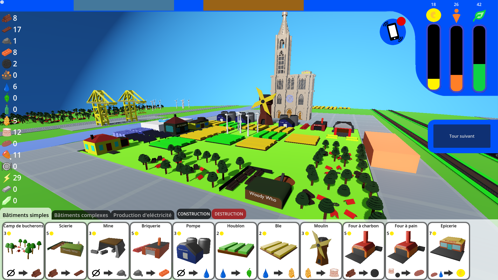

# **HAN23-T3-D**

## **RETER - La reterritorialisation par la matière**

## **Le projet**

Le projet HAN23-T3-D issu du projet tuteuré T4 a pour objectif la création d'un jeu sérieux sur le sujet suivant : Re-territorialiser par la matière. Approche du métabolisme urbain à l'échelle d'un quartier. 
Ce jeu a pour objectif pédagogique de rendre accessible cette notion via l'exploitation de mécaniques de jeu simples et intuitives.


## **Le jeu**

Pour véhiculer cette notion de re-territorialisation par la matière RETER se base sur les mécaniques d'un CITY-BUILDER classique en y ajoutant l'aspect de la gestion des ressources, en permettant ainsi au joueur d'influer sur l'import/export, la gestion de la production locale et la gestion de l'espace urbain.

### **Vue de la version de démonstration**



<br>

## **Lien de téléchargement**


- **Windows (x64) :** https://git.unistra.fr/ungo/han23-t3-d/-/archive/main/han23-t3-d-main.zip?path=Windows_release

- **Linux (x64) :** https://git.unistra.fr/ungo/han23-t3-d/-/archive/main/han23-t3-d-main.zip?path=Linux_release

- **MacOS (ARM) :** Indisponible

<br>

## **Guide d'installation**

Une fois l'exécutable téléchargé, de-ziper le dossier télechargé et lancez-le. 
Le jeu ne nécessite aucune installation sur votre système !

<br>


**Instruction particulière pour linux**
```|
Une fois l'exécutable téléchargé ouvrez un terminal et effectuez les commandes suivantes pour pouvoir jouer au jeu :

- chmod u+x ./RETER (accord du droit d'exécution sur le système)
- ./RETER
```

<br>

# FAQ

## Dois-je installer GODOT pour jouer au jeu ?

Non, toutes les dépendances dont votre système aura besoin sont enpaquettés dans l'éxecutable.
<br>
Vous n'avez donc pas besoin d'avoir une installation de GODOT pour jouer au jeu.

## Comment modifier le code source du jeu ?

Si vous souhaitez développer un module ou modifier le code source de RETER il n'y a rien de plus simple !<br><br>
Pour cela, créez un fork via l'interface de GitLab, clonez-le sur votre machine et commencez à développer.

## Comment configurer GODOT pour ouvrir et compiler le projet ?

Pour pouvoir ouvrir et compiler le projet dans GODOT il vous faut :

- Télécharger le module FBX2GLTF de godot et spécifier son chemin d'accès au premier démarrage
- Dans la fenêtre "Asset Library" il vous faudra télécharger le module "SQLITE3"

Lien vers le module FBX2GLTF : https://godotengine.org/fbx-import/

## Quelle est la version minimale de GODOT que je dois utiliser pour ce projet ?

Pour modifier ce projet, vous aurez besoin d'au moins la **version 4.2 de GODOT**.

Lien vers le site de GODOT : https://godotengine.org/


<br>